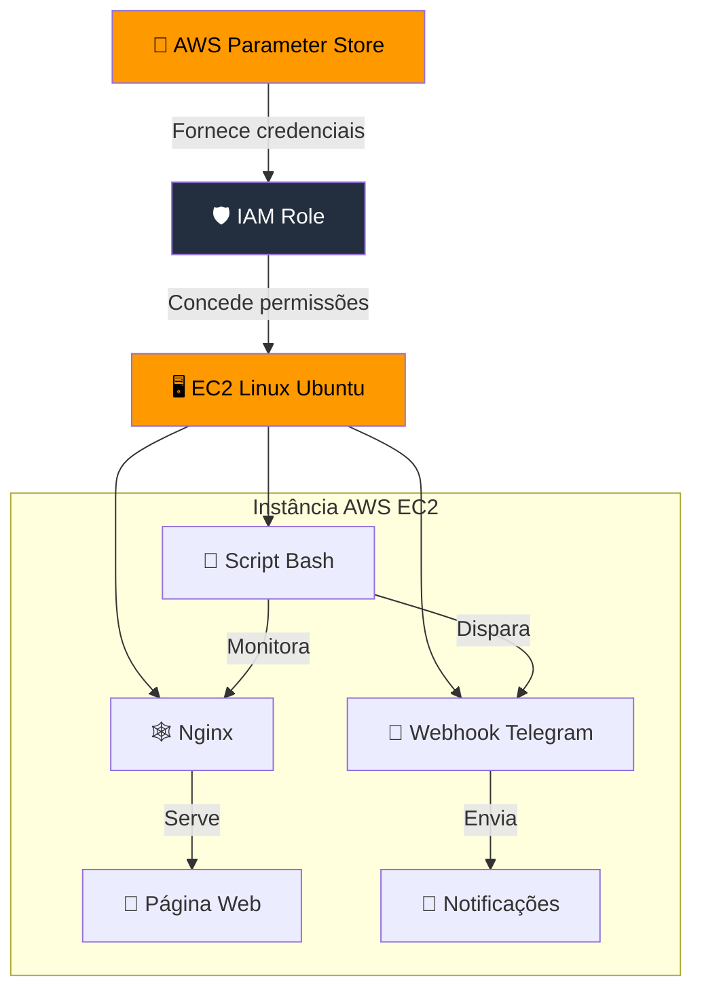

<div align="center">

 </div>
 
# Trabalho da Disciplina Programação para Dispositivos Móveis
 
Quarto trabalho da discilpina Programação para Dispositivos Móveis do curso de Sistemas de Informação da Universidade Federal de Uberlândia


<div align="center">
  
</div>


## 🧾 Índice
aaa


## 📊 Diagrama de Arquitetura do Sistema



## 📖 Sobre o Aplicativo

Esse aplicativo possui as seguintes funcionalidades:

## ✅ Funcionalidades

- ✅ Autentificação com Email e Senha com o Google Firebase;
- ✅ Banco de Dados das Questões utilizando o Realtime Database do Google Firebase;
- ✅ Histórico de Performance


## 🛠️ Tecnologias Utilizadas

- [Android Studio](https://developer.android.com/)
- [Firebase](https://firebase.google.com/)
- [JetPack Compose](https://developer.android.com/compose)
- [Kotlin](https://kotlinlang.org/)


<!--

  
- [MongoDB](https://www.mongodb.com/)
- Outros...

## 📦 Instalação

```bash
# Clone o repositório
git clone https://github.com/seunome/seuprojeto.git

# Acesse a pasta
cd seuprojeto

# Instale as dependências
npm install

# Inicie o projeto
npm start
-->
