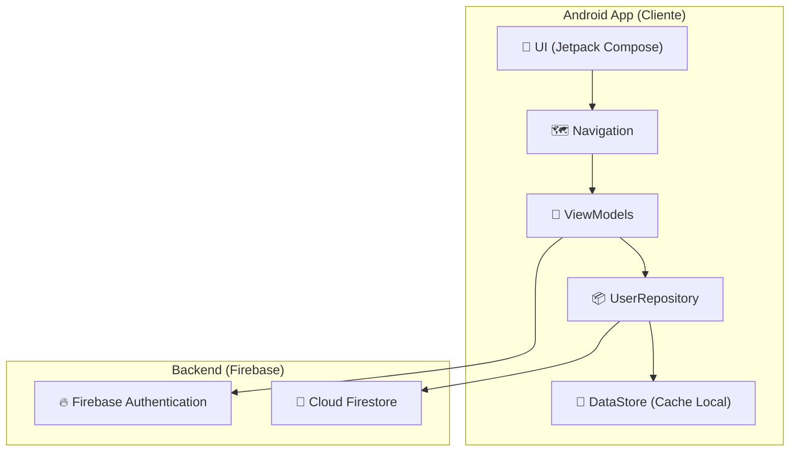

<div align="center">

 </div>
 
# Trabalho da Disciplina Programação para Dispositivos Móveis
 
Esse é o repositório para o quarto trabalho da discilpina Programação para Dispositivos Móveis do curso de Sistemas de Informação da Universidade Federal de Uberlândia. 
###### Por Luiz Fellipe Silva Lima, Eduardo Antônio da Silva e Rogério Anastácio

<br>
<div align="center">
  
</div>


<br><br>

## 🧾 Índice 

* [ 📊 Diagrama de Arquitetura do Sistema](#-diagrama-de-arquitetura-do-sistema)
* [ 📖 Sobre o Aplicativo](#-sobre-o-aplicativo)
* [ ✅ Funcionalidades](#-funcionalidades)
* [ 🛠️ Tecnologias Utilizadas](#%EF%B8%8F-tecnologias-utilizadas)
* [ 🚀 Como Executar o Projeto](#-como-executar-o-projeto)
* [ 🔮 Melhorias Futuras](#-melhorias-futuras)

<br><br>


## 📊 Diagrama de Arquitetura do Sistema



<br>

[Retornar ao 🧾Indice](#-%C3%ADndice)

<br>

## 📖 Sobre o Aplicativo

Este é um aplicativo de quiz para Android, desenvolvido em Kotlin com Jetpack Compose. O aplicativo permite que os usuários se cadastrem, façam login, respondam a quizzes de diferentes categorias, acompanhem seu histórico de desempenho e vejam um ranking de pontuações. 
O aplicativo foi projetado para funcionar tanto online quanto offline, utilizando o Firebase para serviços de backend e o DataStore para cache de dados locais.


<br>

[Retornar ao 🧾Indice](#-%C3%ADndice)

<br>

## ✅ Funcionalidades

- ✅ Autenticação de Usuário: Sistema completo de cadastro e login com e-mail e senha, utilizando o Firebase Authentication.
- ✅ Navegação Intuitiva: Navegação entre as telas de login, cadastro, home, quiz e resultados.
- ✅ Experiência Offline: O aplicativo permite o login offline e armazena os dados do usuário localmente, garantindo o acesso mesmo sem conexão com a internet.
- ✅ Interface Moderna: A interface do usuário é construída com Jetpack Compose, proporcionando uma experiência de usuário moderna e reativa.
- ✅ Histórico de Performance: Os usuários podem visualizar seu histórico de quizzes concluídos, incluindo pontuação, precisão e tempo gasto.
- ✅ Ranking de Jogadores: Uma tela de ranking exibe a pontuação dos melhores jogadores.


<br>

[Retornar ao 🧾Indice](#-%C3%ADndice)

<br>

## 🛠️ Tecnologias Utilizadas

-   **[Kotlin](https://kotlinlang.org/):** Linguagem de programação oficial para o desenvolvimento Android.
-   **[Jetpack Compose](https://developer.android.com/jetpack/compose):** Kit de ferramentas moderno para a criação de interfaces de usuário nativas do Android.
-   **[Firebase Authentication](https://firebase.google.com/docs/auth):** Para gerenciar a autenticação de usuários.
-   **[Cloud Firestore](https://firebase.google.com/docs/firestore):** Banco de dados NoSQL para armazenar os dados do usuário.
-   **[DataStore](https://developer.android.com/topic/libraries/architecture/datastore):** Solução de armazenamento de dados que permite salvar pares de chave-valor ou objetos tipados com buffers de protocolo.
-   **[Android ViewModel](https://developer.android.com/topic/libraries/architecture/viewmodel):** Para gerenciar os dados da interface do usuário de maneira consciente do ciclo de vida.
-   **[Android Navigation](https://developer.android.com/guide/navigation):** Para lidar com a navegação entre as telas do aplicativo.
-   **[Coroutines](https://kotlinlang.org/docs/coroutines-overview.html):** Para gerenciar tarefas assíncronas.


<br>

[Retornar ao 🧾Indice](#-%C3%ADndice)

<br>

## 🚀 Como Executar o Projeto

Para compilar e executar este projeto localmente, siga os passos abaixo:

1.  **Clone o Repositório**
    ```bash
    git clone [https://github.com/seu-usuario/seu-repositorio.git](https://github.com/seu-usuario/seu-repositorio.git)
    ```

2.  **Configuração do Firebase**
    * Vá até o [console do Firebase](https://console.firebase.google.com/).
    * Crie um novo projeto.
    * Adicione um aplicativo Android ao seu projeto Firebase com o nome de pacote `com.example.vcquizo`.
    * Siga os passos para baixar o arquivo `google-services.json`.
    * Copie o arquivo `google-services.json` que você baixou e cole-o no diretório `app/` do projeto.
    * No console do Firebase, habilite os serviços de **Authentication** (com o provedor "E-mail/senha") e **Firestore Database**.

3.  **Abra no Android Studio**
    * Abra o projeto no Android Studio.
    * O Gradle irá sincronizar e baixar todas as dependências necessárias.
    * Execute o aplicativo em um emulador ou dispositivo físico.

<br>

[Retornar ao 🧾Indice](#-%C3%ADndice)

<br>

## 🔮 Melhorias Futuras
* Implementar a edição do perfil do usuário (alterar nome, foto, etc.).
* Adicionar diferentes tipos de perguntas (múltipla escolha, verdadeiro/falso, etc.).
* Melhorar a interface com mais animações e transições.

<br>

[Retornar ao 🧾Indice](#-%C3%ADndice)

<br>
  
<!--
Desenvolvido por:
-Luiz Fellipe Silva Lima
-Eduardo Antônio da Silva 
-Rogério Anastácio
-->
