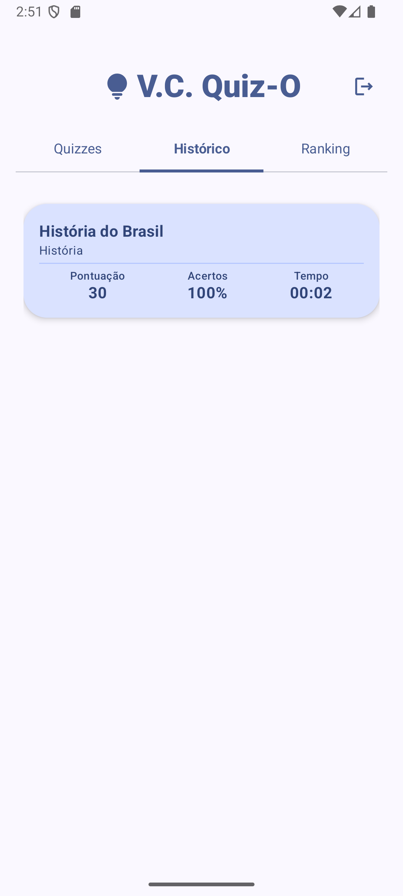

<div align="center">

 </div>
 
# Trabalho da Disciplina Programação para Dispositivos Móveis
 
Esse é o repositório para o quarto trabalho da discilpina Programação para Dispositivos Móveis do curso de Sistemas de Informação da Universidade Federal de Uberlândia. 
###### Por Luiz Fellipe Silva Lima, Eduardo Antônio da Silva e Rogério Anastácio

<br>
<div align="center">
  
</div>


<br><br>

## 🧾 Índice 

* [ 📊 Diagrama de Arquitetura do Sistema](#-diagrama-de-arquitetura-do-sistema)
* [ 📖 Sobre o Aplicativo](#-sobre-o-aplicativo)
* [ 📖 Capturas de Tela](#-capturas-de-tela)
* [ ✅ Funcionalidades](#-funcionalidades)
* [ 🛠️ Tecnologias Utilizadas](#%EF%B8%8F-tecnologias-utilizadas)
* [ 🚀 Como Executar o Projeto](#-como-executar-o-projeto)
* [ 🔮 Melhorias Futuras](#-melhorias-futuras)

<br><br>


## 📊 Diagrama de Arquitetura do Sistema

```mermaid
graph TD
    subgraph "Android App (Cliente)"
        UI["📱 UI (Jetpack Compose)"]
        NAV["🗺️ Navigation"]
        VMs["🧠 ViewModels"]
        REPO["📦 UserRepository"]
        DS["💾 DataStore (Cache Local)"]
    end

    subgraph "Backend (Firebase)"
        AUTH["🔥 Firebase Authentication"]
        RTDB["🚀 Realtime Database (Quizzes)"]
        FS["📄 Cloud Firestore (Usuários e Ranking)"]
    end

    UI --> NAV
    NAV --> VMs
    VMs --> REPO
    VMs --> RTDB
    REPO --> DS
    REPO --> FS
    VMs --> AUTH
```



<br>

[Retornar ao 🧾Indice](#-%C3%ADndice)

<br>

## 📖 Sobre o Aplicativo

Este é um aplicativo de quiz para Android, desenvolvido em Kotlin com Jetpack Compose. O aplicativo adota uma arquitetura de backend híbrida, utilizando o Firebase Realtime Database para armazenar e fornecer o conteúdo dos quizzes (perguntas, opções, etc.) e o Cloud Firestore para gerenciar os perfis dos usuários, suas pontuações e o ranking geral.

Além disso, o aplicativo foi projetado para funcionar online e offline, utilizando o DataStore para cache de dados do usuário localmente.


<br>

[Retornar ao 🧾Indice](#-%C3%ADndice)

<br>

## 📸 Capturas de Tela

<table>
  <tr>
    <td style="text-align: center;">
      <br/>
      <span style="text-align: center;">Tela de Login</span>
    </td>
    <td style="text-align: center;">
      <br/>
      <span style="text-align: center;">Tela de Registro</span>
    </td>
   <td style="text-align: center;">
      <br/>
      <span style="text-align: center;">Seleção de Quiz</span>
    </td>
   <td style="text-align: center;">
      <br/>
      <span style="text-align: center;">Quiz</span
    </td>
   <td style="text-align: center;">
      <br/>
      <span style="text-align: center;">Quiz Acerto</span>
    </td>
   <td style="text-align: center;">
      <br/>
      <span style="text-align: center;">Quiz Erro</span>
    </td>
    <td style="text-align: center;">
      <br/>
      <span style="text-align: center;">Histório de Quizzes</span>
    </td>
    <td style="text-align: center;">
      <br/>
      <span style="text-align: center;">Rank de Pontuação</span>
    </td>
  </tr>
</table>


<!--


-->


<br>

[Retornar ao 🧾Indice](#-%C3%ADndice)

<br>


## ✅ Funcionalidades

- ✅ Autenticação de Usuário: Sistema completo de cadastro e login com e-mail e senha, utilizando o Firebase Authentication.
- ✅ Quizzes Dinâmicos: As perguntas e os quizzes são carregados diretamente do Firebase Realtime Database.
- ✅ Ranking de Pontuação: O aplicativo possui uma aba de ranking que exibe os jogadores com as maiores pontuações, com dados gerenciados pelo Cloud Firestore.
- ✅ Experiência Offline: Permite login offline e armazena dados do usuário localmente, garantindo o acesso mesmo sem conexão à internet.
- ✅ Navegação Intuitiva: Navegação entre as telas de login, cadastro, home, quiz e resultados.
- ✅ Interface Moderna: A interface do usuário é construída com Jetpack Compose, proporcionando uma experiência de usuário moderna e reativa.
- ✅ Histórico de Performance: Os usuários podem visualizar seu histórico de quizzes concluídos.


<br>

[Retornar ao 🧾Indice](#-%C3%ADndice)

<br>

## 🎨 Design e Interface

A interface do aplicativo foi desenvolvida com foco na simplicidade e usabilidade, seguindo os princípios do Material Design.
* Layout Principal: A tela inicial (HomeScreen) é organizada com uma navegação por abas (TabRow) que separam as seções de "Quizzes", "Histórico" e "Ranking".
* Paleta de Cores: O tema do aplicativo utiliza o Laranja (Orange) como cor primária, criando um visual vibrante e consistente em todos os componentes.
* Iconografia: O ícone principal do aplicativo é uma lâmpada, simbolizando ideias e conhecimento, presente na tela de login e no cabeçalho da home.

<br>

[Retornar ao 🧾Indice](#-%C3%ADndice)

<br>

## 🛠️ Tecnologias Utilizadas

-   **[Kotlin](https://kotlinlang.org/):** Linguagem de programação oficial para o desenvolvimento Android.
-   **[Android Navigation](https://developer.android.com/guide/navigation):** Para lidar com a navegação entre as telas do aplicativo.
-   **[Android ViewModel](https://developer.android.com/topic/libraries/architecture/viewmodel):** Para gerenciar os dados da interface do usuário de maneira consciente do ciclo de vida.
-   **[Coroutines](https://kotlinlang.org/docs/coroutines-overview.html):** Para gerenciar tarefas assíncronas.
-   **[Cloud Firestore](https://firebase.google.com/docs/firestore):** Banco de dados NoSQL da Firebase, escalável e baseado em documentos, usado para armazenar e sincronizar dados do usuário em tempo real e o sistema de ranking.
-   **[DataStore](https://developer.android.com/topic/libraries/architecture/datastore?hl=pt-br):** Solução de armazenamento local para o cache dos dados de usuário.
-   **[Firebase Authentication](https://firebase.google.com/docs/auth):** Para gerenciar a autenticação de usuários.
-   **[Firestore Realtime Database](https://firebase.google.com/docs/database?hl=pt-br):** Utilizado para armazenar e servir o conteúdo dos quizzes.
-   **[Jetpack Compose](https://developer.android.com/jetpack/compose):** Kit de ferramentas moderno para a criação de interfaces de usuário nativas do Android.


<br>

[Retornar ao 🧾Indice](#-%C3%ADndice)

<br>

## 🚀 Como Executar o Projeto

Para compilar e executar este projeto localmente, siga os passos abaixo:

1.  **Clone o Repositório**
    ```bash
    git clone [https://github.com/seu-usuario/seu-repositorio.git](https://github.com/seu-usuario/seu-repositorio.git)
    ```

2.  **Configuração do Firebase**
    * Vá até o [console do Firebase](https://console.firebase.google.com/).
    * Crie um novo projeto.
    * Adicione um aplicativo Android ao seu projeto Firebase com o nome de pacote `com.example.vcquizo`.
    * Siga os passos para baixar o arquivo `google-services.json`.
    * Copie o arquivo `google-services.json` que você baixou e cole-o no diretório `app/` do projeto.
    * No console do Firebase, habilite os serviços de **Authentication** (com o provedor "E-mail/senha") e **Firestore Database**.

3.  **Abra no Android Studio**
    * Abra o projeto no Android Studio.
    * O Gradle irá sincronizar e baixar todas as dependências necessárias.
    * Execute o aplicativo em um emulador ou dispositivo físico.

<br>

[Retornar ao 🧾Indice](#-%C3%ADndice)

<br>

## 🔮 Melhorias Futuras
* Implementar a edição do perfil do usuário (alterar nome, foto, etc.).
* Adicionar diferentes tipos de perguntas (múltipla escolha, verdadeiro/falso, etc.).
* Melhorar a interface com mais animações e transições.

<br>

[Retornar ao 🧾Indice](#-%C3%ADndice)

<br>
  
<!--
Desenvolvido por:
-Luiz Fellipe Silva Lima
-Eduardo Antônio da Silva 
-Rogério Anastácio
-->
